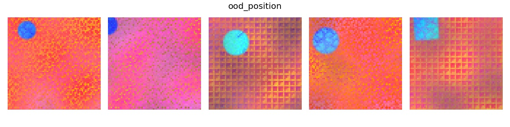
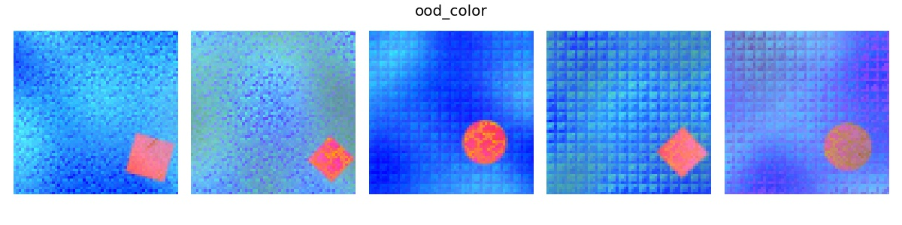

*******
ProDAS
*******
Probabilistic Dataset of Abstract Shapes

What is this?
###############

* This library provides a latent factor model that can be applied to any rendering function in a flexible way.
  It can sample inputs to the rendering function, and evaluate their likelihood. 
  It can support multiple different distributions at the same time
  (for instance, in-distribution and out-of-distribution, or different environments).
* Additionally, it provides 'Dsprites++' as a rendering frontend, supporting colors, textures, and more.
* It provides sensible defaults for creating a meaningful dataset, ready generated and provided for download.

Possible applications for the dataset:

* Out-of-distribution detection
* Concept discovery
* Disentanglement
* Causal discovery
* Domain transfer, domain adaption, few-shot learning, etc.
* Generative modeling/density estimation

ToDos
#########

* [x] Distributions for the latent factor model
* [x] Latent factor model with sampling and likelihoods, multiple distributions
* [ ] Support for latent SCMs
* [ ] Simple parallel rendering via a `.sample_parallel()` method
* [x] Basic shapes rendering
* [x] Textures, perlin noise, other post-processing
* [ ] Arrangements of multiple foreground shapes in a specified

Usage
#########

For an example on how to use a pre-defined latent model in combination with one of our rendering functions see `example.py`_. The basic structure is as follows::

    from latent_model import BaseGenerator
    import latent_model.distributions as ds

    c1 = np.array((66,  221, 237), dtype=np.float) / 255.
    model = BaseGenerator(renderer,
        fg_color_1 = ds.ContinuousNormal(c1,0.02)
        ...
        )
    model.set_distribution('in_distribution', inherit_from='default')

.. _example.py: example.py

The ``BaseGenerator`` is the starting point in the data generating process. It takes as input the ``renderer`` and arguments that are specific to the ``renderer`` like ``fg_color_1``. For each argument, we define a distribution that determines the distribution of the argument - in this case ``fg_color_1`` follows certain a normal distribution. In `latent_model/distributions.py`_ we offer several predefined distributions. With ``model.set_distribution(name, inherit_from='default')`` we set on a latent model that inherits the distribution from the ``model`` as defined above and can be called using ``name``. We can define several different latent models like that. For instance::

    model.set_distribution('ood_shape', inherit_from='default',
        object_shape    = ds.DiscreteChoice(['triangle'])
                                              )

defines a new distribution that differs from the original distribution in the shape distribution. Similarly, we can define many distributions that go under different names. During sampling, we can draw ``n_samples`` from a distribution, e.g. ``name='ood_shape'`` like
::

    samples = model.sample(n=n_samples, distribution=name)

The user can customize the data generating process by changing: (1) the *latent model* or (2) the *renderer*.

Examples for latent models can be found in `latent_model/distributions.py`_. A new distribution is a class that has two methods, namely ``sample`` and ``log_likelihood`` as for instance in::

    class Distribution:
        def sample(self, n=None):
            return [0] * n if n else 0

        def log_likelihood(self, x):
            return -np.inf

.. _latent_model/distributions.py: latent_model/distributions.py

The generated samples can be easily cast into a pytorch dataloader as shown in `dataloader.py`_.

.. _dataloader.py: dataloader.py

(How the renderer can be customized will be described)

Example
#########

The script `example.py` shows how to define a model with a default distribution (in-distribution)
and several other distributions that differ in various ways (out-of-distribution, OoD).

.. image:: example_figures/ood_shape.jpg
            :width: 800px
            :align: left

.. image:: example_figures/ood_texture.jpg
            :width: 800px
            :align: left

