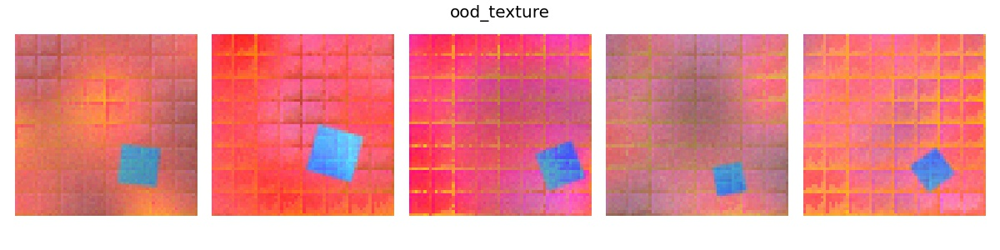

*******
ProDAS
*******
Probabilistic Dataset of Abstract Shapes

What is this?
###############

* This library provides a latent factor model that can be applied to any rendering function in a flexible way.
  It can sample inputs to the rendering function, and evaluate their likelihood. 
  It can support multiple different distributions at the same time
  (for instance, in-distribution and out-of-distribution, or different environments).
* Additionally, it provides 'Dsprites++' as a rendering frontend, supporting colors, textures, and more.
* It provides sensible defaults for creating a meaningful dataset, ready generated and provided for download.

Possible applications for the dataset:

* Out-of-distribution detection
* Concept discovery
* Disentanglement
* Causal discovery
* Domain transfer, domain adaption, few-shot learning, etc.
* Generative modeling/density estimation

ToDos
#########

* [x] Distributions for the latent factor model
* [x] Latent factor model with sampling and likelihoods, multiple distributions
* [ ] Support for latent SCMs
* [ ] Simple parallel rendering via a `.sample_parallel()` method
* [x] Basic shapes rendering
* [x] Textures, perlin noise, other post-processing
* [ ] Arrangements of multiple foreground shapes in a specified

Example
#########

The script `example.py` shows how to define a model with a default distribution (in-distribution)
and several other distributions that differ in various ways (out-of-distribon, OoD).

.. image:: example_figures/in_distribution.jpg
            :width: 800px
            :align: left

.. image:: example_figures/ood_position.jpg
            :width: 800px
            :align: left

.. image:: example_figures/ood_color.jpg
            :width: 800px
            :align: left

